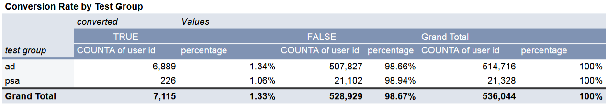
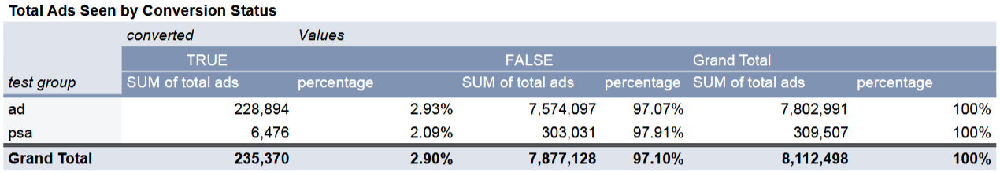
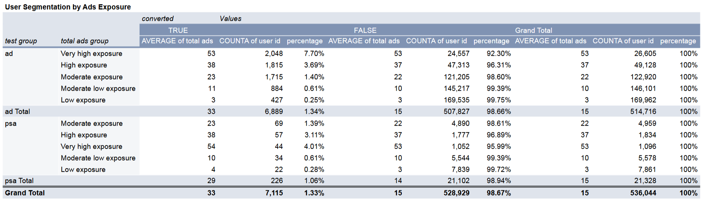
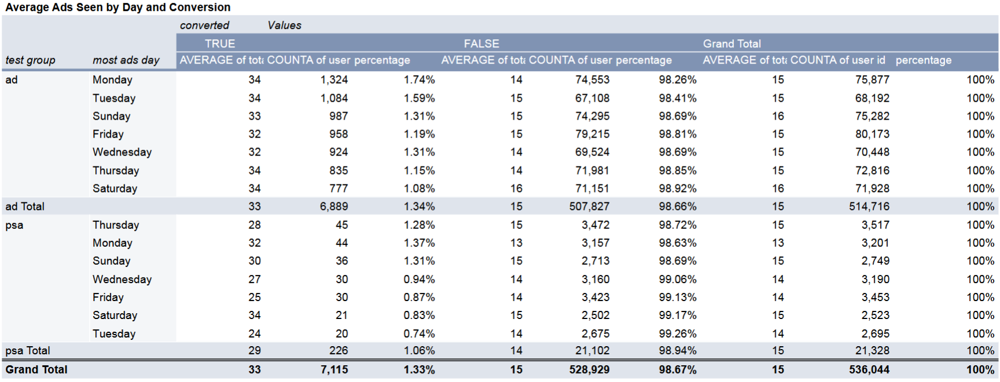
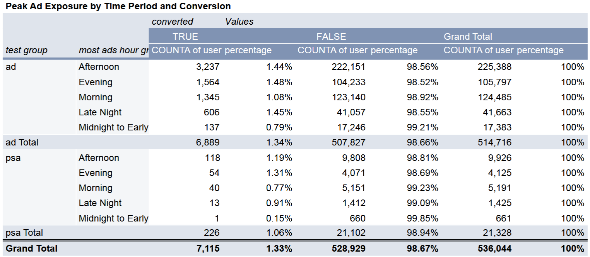
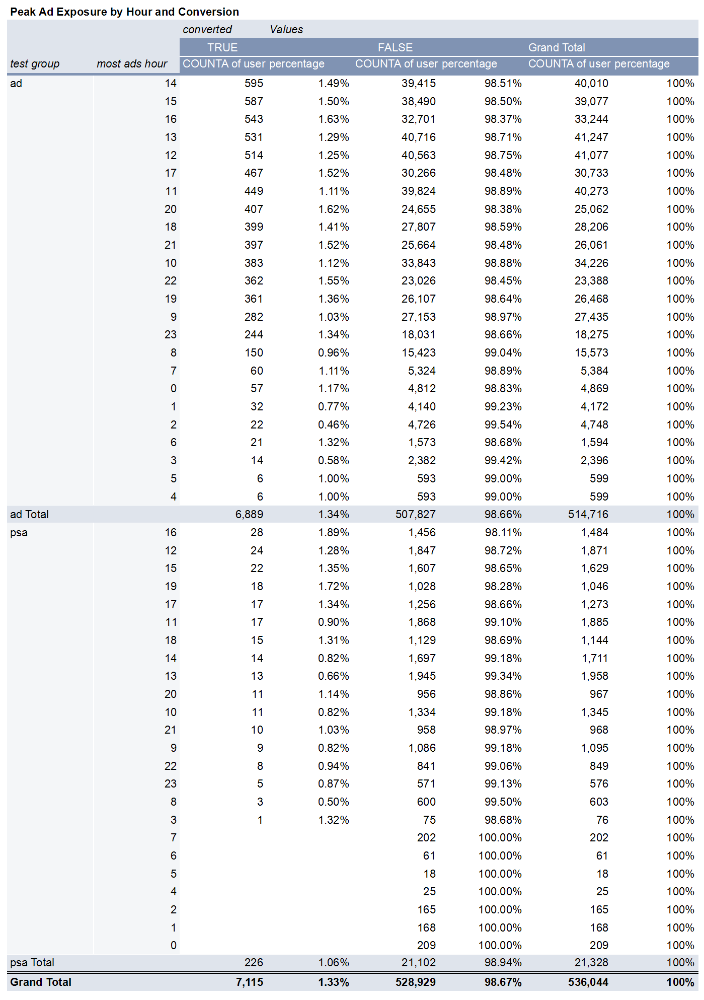

# A/B Tests Analysis on Advertising Initiative Efforts

## Table of Contents
- [Overview](#background-and-overview)
- [Methodology](#methodology)
- [Key Dimensions](#key-dimensions)
- [Data Preprocessing](#data-preprocessing)
- [Executive Summary](#executive-summary)
- [Recommendations and Next Steps](#recommendations-and-next-steps)

## Overview
This A/B test analysis focuses on the 1st week test run of a 3-week campaign aimed at evaluating the efforts for an advertising initiative. The goal is to understand the effectiveness of Ads versus using only Public Service Announcements (PSAs) and to derive actionable insights that can improve campaign performance in the subsequent weeks.
**Data Source:** [Marketing A/B Testing](https://www.kaggle.com/datasets/faviovaz/marketing-ab-testing/)

## Methodology
This involves exposing a majority of participants to advertisements (experimental group) while a smaller portion views a Public Service Announcement (PSA). Participants are randomly assigned to these groups to eliminate bias. Data is collected on key metrics, including conversion status and total ads seen, to analyze the effectiveness of the ads. The analysis focuses on determining whether the ads were successful in driving conversions.

## Key Dimensions
To effectively guide the analysis, several key dimensions are identified to serve as focal points for the investigation:
  - **Test Group:** Assess and Compare the conversion status between users exposed to ads and those who saw PSAs.
  - **Day of Exposure:** Explore how conversion status is affected by the different hours or periods of the day.
  - **Period / Hour of Exposure:** Explore how conversion status is affected by the different hours or periods of the day.

## Data Preprocessing
Data was preprossed to ensure accuracy in analysis. This included:
- **Data Overview:** Initial examination includes checking the first few records, understanding the shape of the dataset, and identifying any missing values.
- **Data Cleaning:** Missing values were not found in the dataset.
- **Outlier Analysis:**
    Outlier detection was conducted using the Interquartile Range (IQR) method, which identifies outliers as values that fall significantly outside the typical range of data. In this analysis, 9% of the dataset was found to be outliers, and they were flagged and excluded during pivot table analysis.
    Excluding these outliers is essential for improving the accuracy and reliability of the predictive models. Extreme values can distort the results and lead to misleading insights, making it crucial to address outliers during data preprocessing.
- **Data Transformation:** The absolute response values in some columns are categorised into distinct groups to enhance clarity in pivot table analysis.

A more detailed view for the data preprocessing can be found **[here](data_preprocessing.pdf)**.

The formula utilised for the data preprocessing can be found **[here](marketing_AB.xlsx)**.

## Executive Summary
- The overall conversion rate for the ad group was 1.34%, while the PSA group achieved a conversion rate of 1.06%.
- User segmentation based on ad exposure levels indicated that higher ad visibility correlated with increased conversion rates. 
- The analysis of average ads seen by day showed variations in user engagement throughout the week, with Monday and Tuesday yielding the highest conversion rate.
- Peak ad exposure by hour revealed that afternoons generally had the highest conversion rates, particularly for the period between 14:00 to 16:59. 

## Recommendations and Next Steps
Based on the findibngs from the test run:
- **Optimize Ad Exposure:** Focus on the hours and days that showed higher conversion rates, particularly in the early part of the week and during peak hours.
- **Iterate on Campaign Messaging:** Test different ad messages to enhance engagement and conversion.
- **Monitor Performance:** Continuously analyze data from the next 2 weeks to refine strategies and ensure campaign success.